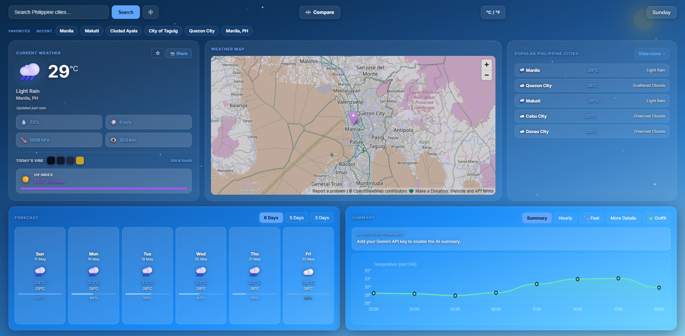
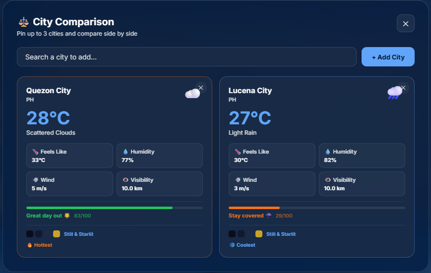
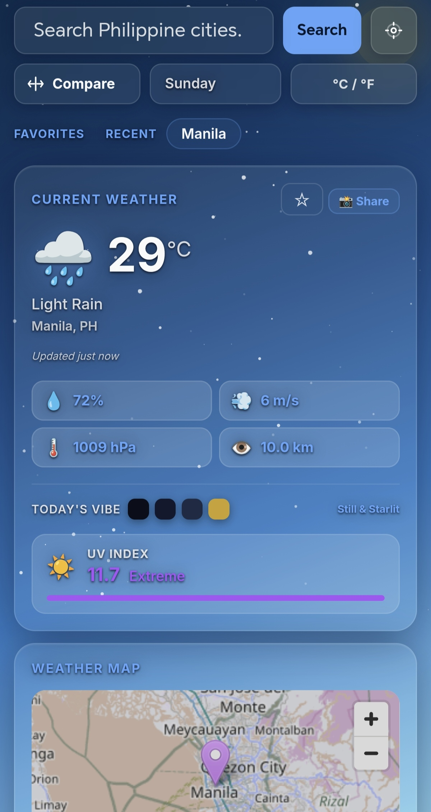

# Weather Dashboard PH

A Philippines-focused weather dashboard built with **HTML, CSS, and vanilla JavaScript**. Live data from OpenWeatherMap, deployed on Vercel with a serverless API proxy so your API key stays off the client in production.

## Live demo

`https://weather-app-mu-ten-10.vercel.app/`

## Features

- Search any city or use **geolocation**
- **80+ Philippine cities** by region (Metro Manila, Luzon, Visayas, Mindanao)
- **Compare up to 3 cities** side by side
- Multi-day **forecast** with rain probability
- **Canvas charts** — temperature summary and feels-like timeline
- **Outfit & activity** suggestions from weather conditions
- **Plain-language weather alerts** (dismissible, session-aware)
- **Favorites & recent searches** (saved in your browser)
- **°C / °F** toggle, shareable weather card image
- Condition-based **animated backgrounds**

## Tech stack

| Layer | Choice |
|--------|--------|
| UI | HTML5, CSS3 (glassmorphism, responsive) |
| Logic | Vanilla JavaScript |
| Data | OpenWeatherMap API |
| Hosting | Vercel (static + `/api/weather` proxy) |
| Tests | Node.js built-in test runner |

## Screenshots

## Screenshots

### Dashboard


### Compare Cities


### Mobile View


## Local development

1. Clone the repo and open the folder.

### Option A — Vercel CLI (recommended)

```bash
npm i -g vercel
vercel env pull .env.local
vercel dev
```

Or set `OPENWEATHERMAP_API_KEY` manually.

### Option B — Static only

Open `index.html` using a local server or VS Code Live Server.

On first weather request, the app will prompt for an OpenWeatherMap API key and store it in `localStorage`.


## Environment variables (Vercel)

In **Vercel → Project → Settings → Environment Variables**, add:

| Name | Description |
|------|-------------|
| `OPENWEATHERMAP_API_KEY` | Your key from [OpenWeatherMap](https://home.openweathermap.org/api_keys) |

Redeploy after adding the variable.

## Scripts

```bash
npm test
```

Runs unit tests for shared weather utilities in `lib/weather-utils.mjs`.

## Project structure

```
weather-app/
├── api/weather.js      # Vercel serverless proxy
├── docs/
   └── dashboard.png
   └── compare.png
   └── mobile.png
├── lib/weather-utils.mjs
├── tests/
├── index.html
├── style.css
├── script.js
├── manifest.json       # PWA manifest (installable hint)
├── CASE_STUDY.md
└── vercel.json
```

## Optional: AI summaries

To enable AI weather text in the Summary panel, set `AI_API_KEY` in `script.js` (Gemini or OpenRouter). For production, move AI calls behind a server route like the weather proxy.

## License

MIT — use freely for learning and portfolio.
